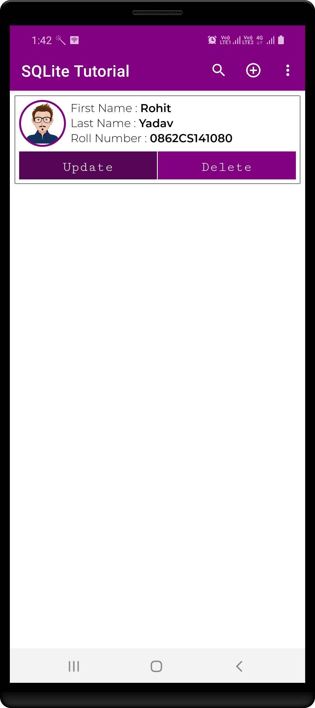

# JAVA - SQLiteTutorial #

Let SQLiteTutorial support

- Insert, Update, Delete Operation
- Add image on SQLite Database
- Import From Assets
- Import From External Storage
- Export On External Storage

|           Click on + button       |                 2                 |                 3                 |              Insert              |
|-----------------------------------|-----------------------------------|-----------------------------------|----------------------------------|
|  |  |  | |

|                  5                |      Click on update buttonn      |                 7                 |              Update              |
|-----------------------------------|-----------------------------------|-----------------------------------|----------------------------------|
|  |  |  | |

|                  9                |              Search               |             Delete                |              Export              |
|-----------------------------------|-----------------------------------|-----------------------------------|----------------------------------|
|  | | ||

|create exportDirectory Using SAF    |               2                  |                    3                 |                 2                |              
|------------------------------------|----------------------------------|--------------------------------------|----------------------------------|
|  ||    ||

## Author ##

Rohit Yadav

[rohitnotes24@gmail.com](mailto:rohitnotes24@gmail.com)

[http://badasoftware.com/](http://badasoftware.com/)
